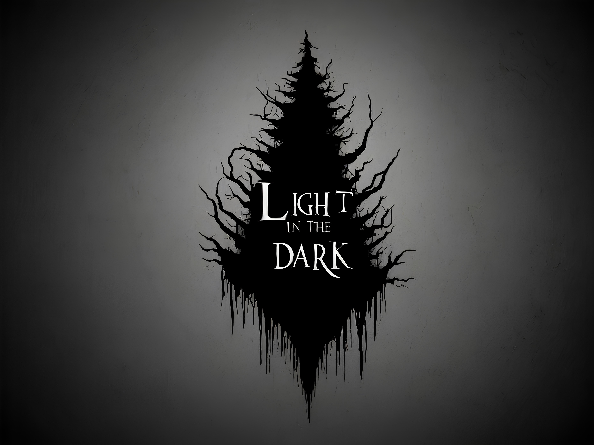

# Light in the Dark



## Descripción

**Light in the Dark** es un videojuego sombrío desarrollado con Unity utilizando el pipeline de renderizado de alta definición (HDRP). Este proyecto combina intensos combates y desafiantes puzles para ofrecer una experiencia inmersiva y cautivadora. Actualmente, el juego está en fase de demo técnico, pero se continuará desarrollando hasta alcanzar un estándar de calidad de nivel profesional.

## Características

- **Gráficos de alta calidad**: Utilizamos HDRP de Unity para lograr una calidad visual impresionante.
- **Combates intensos**: Mecánicas de combate fluidas y emocionantes.
- **Puzles desafiantes**: Integra enigmas y desafíos que pondrán a prueba tu ingenio.
- **Ambiente sombrío**: Una atmósfera oscura y envolvente que te sumerge en la narrativa del juego.

## Instalación

1. **Clona el repositorio**:
    ```bash
    git clone https://github.com/tu-usuario/Light-in-the-Dark.git
    ```

2. **Abre el proyecto en Unity**:
    - Asegúrate de tener instalada la versión de Unity compatible con HDRP.
    - Desde Unity Hub, selecciona "Add" y navega hasta la carpeta del proyecto clonado.

3. **Importa los paquetes necesarios**:
    - Dentro de Unity, asegúrate de que todos los paquetes necesarios estén instalados a través del Package Manager.
    - Si falta algún paquete, instálalo desde el Package Manager de Unity.

## Uso

- **Explora el demo técnico**: Navega por las diferentes escenas disponibles en el proyecto para experimentar los combates y los puzles.
- **Reporta problemas**: Si encuentras algún bug o problema, por favor abre un issue en el repositorio.

## Contribuir

Estamos abiertos a contribuciones de la comunidad. Si deseas colaborar, sigue estos pasos:

1. **Haz un fork del proyecto**.
2. **Crea una rama para tu funcionalidad** (`git checkout -b feature/nueva-funcionalidad`).
3. **Realiza tus cambios** y **haz commit** (`git commit -m 'Añadir nueva funcionalidad'`).
4. **Haz push a tu rama** (`git push origin feature/nueva-funcionalidad`).
5. **Abre un pull request** en GitHub.

## Roadmap

- **Versión Alpha**:
    - Mejoras en las mecánicas de combate.
    - Añadir más puzles y escenarios.
    - Mejoras en la interfaz de usuario.
  
- **Versión Beta**:
    - Optimización del rendimiento.
    - Integración de sonido y música ambiental.
    - Pruebas de jugabilidad y ajustes basados en el feedback de los usuarios.

- **Lanzamiento Final**:
    - Pulido final de gráficos y jugabilidad.
    - Publicación en plataformas seleccionadas.

## Contacto

- **Desarrollador**: Carlos Alejandro Coronado
- **Email**: alejandro.co.dev@gmail.com

## Licencia


